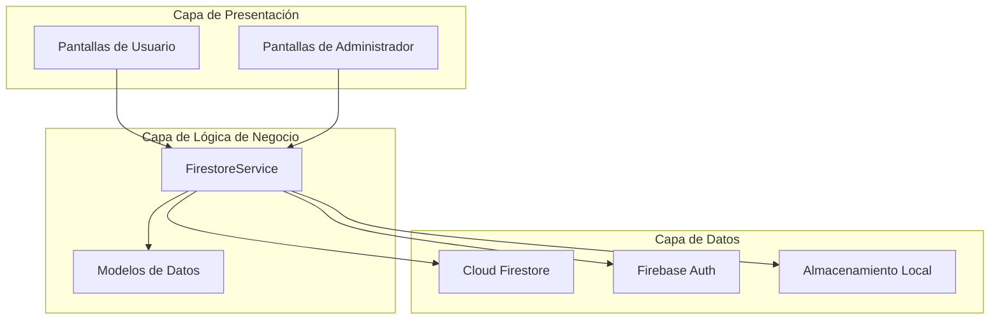
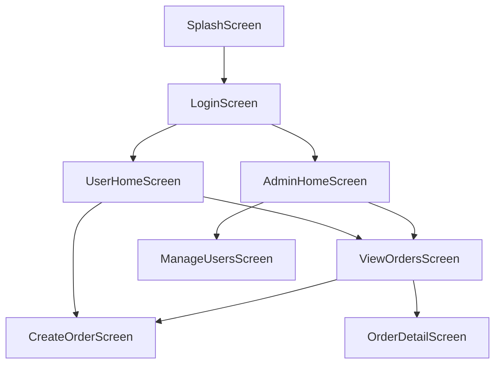

# Suyana - Sistema de Gestión de Órdenes de Trabajo suyana: 

## Descripción General

Suyana es una aplicación Flutter multiplataforma para la gestión de órdenes de trabajo con integración Firebase.El sistema implementa control de acceso basado en roles, soportando usuarios regulares y administradores.

## Arquitectura del Sistema

### Capas de la Aplicación



## Funcionalidades Principales

### Autenticación
- **Email/Contraseña**: Autenticación tradicional suyana: 
- **Google Sign-In**: Autenticación OAuth con creación automática de documentos de usuario suyana:
- **Registro de Usuarios**: Creación de nuevas cuentas suyana: 

### Gestión de Órdenes de Trabajo

#### Creación y Edición
La pantalla `CreateOrderScreen` maneja tanto la creación como la edición de órdenes: suyana: 

**Campos principales:**
- Información del cliente (nombre, dirección, teléfono)
- Datos del vehículo (motor, año, marca, modelo, placa)
- Repuestos con cantidades y precios (solo admin)
- Detalles de mano de obra con precios (solo admin)
- Observaciones y autorización

#### Visualización de Órdenes
La pantalla `ViewOrdersScreen` proporciona diferentes experiencias según el rol: suyana:

**Para Administradores:**
- Selector de usuario para ver órdenes de cualquier usuario
- Búsqueda y filtrado avanzado
- Exportación a PDF
- Gestión completa de órdenes

**Para Usuarios Regulares:**
- Solo visualización de sus propias órdenes
- Funcionalidades básicas de edición

### Generación de PDF
El sistema incluye generación automática de reportes PDF: suyana:

**Características del PDF:**
- Encabezado con logo de la empresa
- Información completa del cliente y vehículo
- Detalles de repuestos y mano de obra
- Totales y firmas suyana:

## Modelos de Datos

### WorkOrder (Orden de Trabajo)
```dart
class WorkOrder {
  String? id;
  String clientName;
  String address;
  String phone;
  Timestamp date;
  String engineNumber;
  String year;
  String brand;
  String model;
  String plate;
  List<SparePart> spareParts;
  List<LaborDetail> laborDetails;
  String authorizedBy;
  String observations;
  String userId;
  String? userName;
  Timestamp? createdAt;
  Timestamp? updatedAt;
}
```

### User (Usuario)
```dart
class User {
  String? id;
  String username;
  String email;
  bool isAdmin;
  Timestamp? createdAt;
}
```

## Servicios Principales

### FirestoreService
Servicio central que maneja todas las operaciones de datos: suyana:361-397 

**Métodos principales:**
- `createWorkOrder()`: Crear nuevas órdenes
- `getWorkOrders()`: Obtener órdenes con filtros
- `updateWorkOrder()`: Actualizar órdenes existentes
- `deleteWorkOrder()`: Eliminar órdenes
- `getAllUsers()`: Gestión de usuarios (solo admin)

### PdfService
Servicio especializado en generación de documentos PDF: suyana:

## Control de Acceso Basado en Roles

### Usuarios Regulares
- Crear y editar sus propias órdenes de trabajo
- Ver solo sus órdenes
- No pueden ver precios ni totales
- No pueden gestionar otros usuarios

### Administradores
- Acceso completo a todas las órdenes
- Gestión de usuarios del sistema
- Visualización de precios y totales
- Exportación de reportes PDF
- Eliminación de órdenes

## Tecnologías Utilizadas

### Frontend
- **Flutter**: Framework multiplataforma
- **Material Design**: Sistema de diseño de UI

### Backend
- **Firebase Auth**: Autenticación de usuarios
- **Cloud Firestore**: Base de datos NoSQL
- **Firebase Core**: Configuración de plataforma

### Servicios Adicionales
- **Google Sign-In**: Autenticación OAuth
- **PDF Generation**: Creación de reportes
- **SharedPreferences**: Almacenamiento local
- **SQLite**: Base de datos local

## Instalación y Configuración

### Prerrequisitos
- Flutter SDK
- Cuenta de Firebase
- Configuración de Google Sign-In

### Dependencias Principales
```yaml
dependencies:
  flutter:
    sdk: flutter
  firebase_core: ^2.27.0
  cloud_firestore: ^4.15.8
  firebase_auth: ^4.17.8
  google_sign_in: ^6.2.1
  pdf: ^3.11.3
  printing: ^5.13.1
```

### Configuración Firebase
1. Crear proyecto en Firebase Console
2. Configurar Authentication (Email/Password y Google)
3. Configurar Firestore Database
4. Descargar archivos de configuración para cada plataforma

## Estructura de Navegación



## Seguridad

### Reglas de Firestore
- Los usuarios solo pueden acceder a sus propias órdenes
- Los administradores tienen acceso completo
- Validación de permisos en el backend

### Autenticación
- Tokens JWT manejados automáticamente por Firebase
- Sesiones persistentes con SharedPreferences
- Logout seguro con limpieza de datos locales

## Notas

La aplicación está diseñada específicamente para servicios de ambulancia ("Servicio de Ambulancia") como se evidencia en los assets y la configuración de la empresa. El sistema de roles permite escalabilidad para múltiples técnicos trabajando bajo supervisión administrativa.